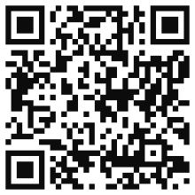

Links to slides:
* [律師x人工智慧](https://drive.google.com/file/d/1E6Ovlvcj-k3KHsNT7IaZY54ZyVPtXFMZ/view?usp=sharing)
* [律師x區塊鍊和智能合約](x.html)
* [律師x大數據和機器學習](x.html)
* [律師xFinTech/RegTech/LegalTech](x.html)

Links to tutorials:
* [Universal Sentence Encoder Colab Notebook](https://colab.research.google.com/github/markshope/AI-for-Lawyers-Beginner-Course/blob/master/AI_for_Lawyers_Contract_Clause_Similarity_Exercise.ipynb)
* [Multilingual Universal Sentence Encoder Colab Notebook](https://colab.research.google.com/github/markshope/AI-for-Lawyers-Beginner-Course/blob/master/Cross_Lingual_Similarity_with_TF_Hub_Multilingual_Universal_Encoder.ipynb)
* [Blockchain Demo](https://markshope.github.io/blockchain-demo/)

